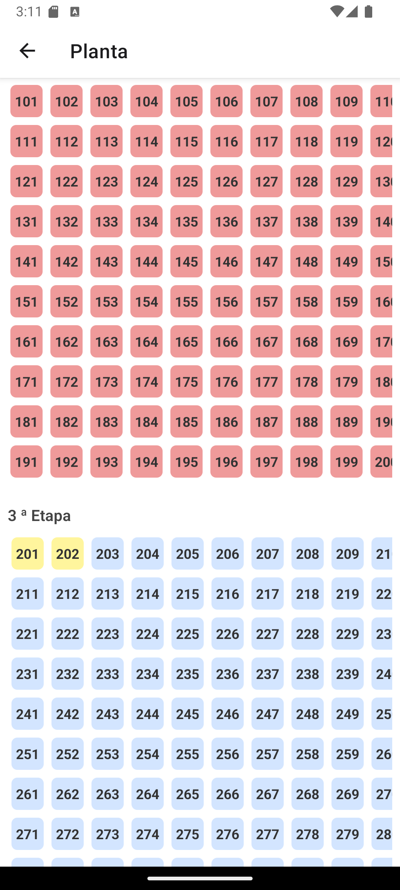
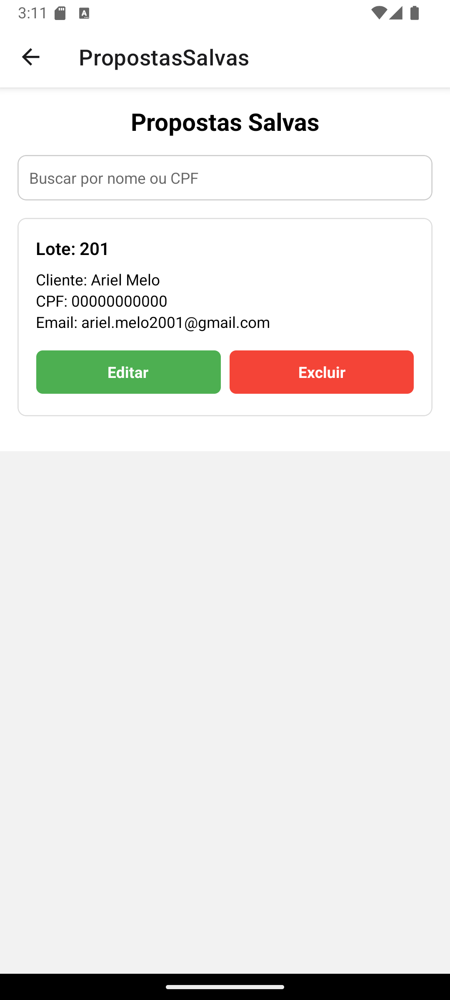
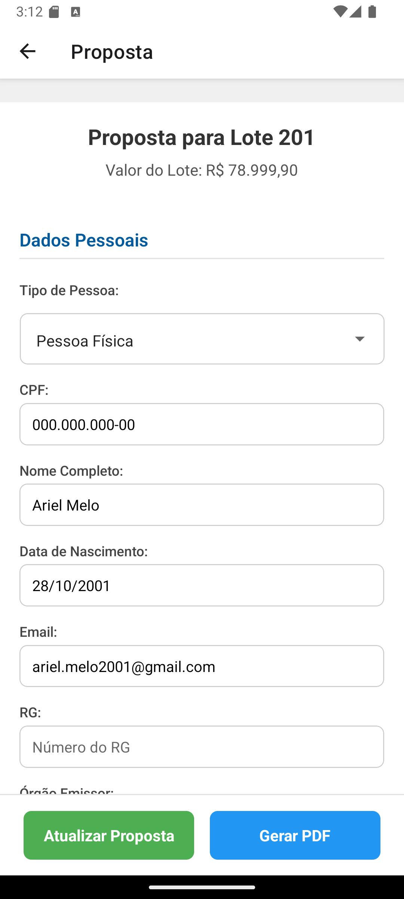
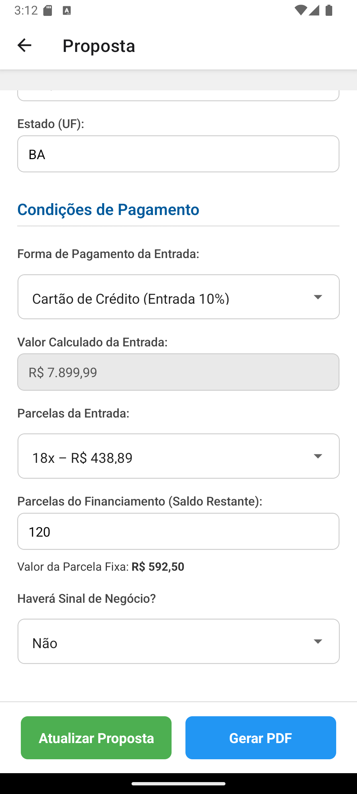

# Projeto de Corretor Imobiliário em React Native

Este repositório contém o aplicativo móvel **Propostas Imobiliárias**, desenvolvido em React Native com integração ao Supabase. O app permite:

- Autenticação de corretores (login/cadastro seguro)
- Listagem de empreendimentos e plantas
- Seleção e reserva de lotes
- Preenchimento de propostas com dados pessoais e condições de pagamento
- Geração de PDF das propostas
- Visualização e gerenciamento de propostas salvas
- Recuperação de senha

---

## 📸 Sessão de Mídia

<!-- Substitua as rotas abaixo pelos caminhos das suas imagens -->







---

## 📋 Sumário

- [Pré-requisitos](#-pré-requisitos)
- [Instalação](#-instalação)
- [Configuração](#-configuração)
- [Estrutura do Projeto](#-estrutura-do-projeto)
- [Fluxos Principais](#-fluxos-principais)
- [Scripts Disponíveis](#-scripts-disponíveis)
- [Tecnologias](#-tecnologias)
- [Boas práticas](#-boas-práticas)
- [Licença](#-licença)

---

## 🔧 Pré-requisitos

- Node.js >=14.x  
- Yarn ou npm  
- Expo CLI (global)  
- Conta no Supabase com URL e API key  

---

## 🚀 Instalação

1. Clone o repositório:
   ```bash
   git clone https://github.com/SEU_USUARIO/app-imobiliario.git
   cd app-imobiliario
   ```

2. Instale as dependências:
   ```bash
   yarn install
   # ou npm install
   ```

3. Inicie o servidor de desenvolvimento Expo:
   ```bash
   expo start
   ```

4. Execute no emulador ou dispositivo físico via QR Code.

---

## ⚙️ Configuração

1. Monte um projeto no Supabase e copie sua URL e `anon` API KEY.  
2. Crie o arquivo `.env` na raiz com:
   ```ini
   SUPABASE_URL=https://xyz.supabase.co
   SUPABASE_KEY=eyJhbGci...
   ```
3. Ajuste permissões no Supabase: tabela `propostas` com colunas JSON para `dados_cliente`, `user_id`, `lote`, `valor`, `pdf_url`, timestamps.

---

## 📁 Estrutura do Projeto

```
├── App.js
├── package.json
├── .env
├── assets/
│   └── imagens, fontes, ícones
├── components/
│   ├── BaseButton.js
│   └── BaseInput.js
├── screens/
│   ├── LoginScreen.js
│   ├── CadastroScreen.js
│   ├── EmpreendimentosScreen.js
│   ├── PlantaScreen.js
│   ├── PropostaScreen.js
│   ├── PropostasSalvasScreen.js
│   ├── EsqueciSenhaScreen.js
│   └── VisualizarPDFScreen.js
├── theme/
│   ├── colors.js
│   ├── spacing.js
│   └── typography.js
├── utils/
│   └── supabase.js
└── README.md
```

---

## 🔄 Fluxos Principais

1. **Autenticação**: Login / Cadastro de corretores com código de autorização.  
2. **Listagem de Empreendimentos**: Tela inicial após login, opção de acessar planta.  
3. **Planta de Lotes**: Grade de lotes com status (vendido, reservado, disponível). Reservar, editar ou cancelar proposta.  
4. **Proposta**: Formulário completo com seções:
   - Dados pessoais (CPF/CNPJ, nome, contato)  
   - Endereço (CEP via ViaCEP)  
   - Condições de pagamento (entrada, parcelas, sinal)  
   - Geração e visualização de PDF  
5. **Propostas Salvas**: Tela de histórico, busca por nome/CPF, editar, excluir, compartilhar/baixar PDF.  
6. **Recuperação de Senha**: Envio de link ou código via Supabase Auth.  

---

## 🛠️ Scripts Disponíveis

- `yarn start` / `npm start`: Inicia o Expo DevTools  
- `yarn android` / `npm run android`: Build and run on Android  
- `yarn ios` / `npm run ios`: Build and run on iOS  
- `yarn web` / `npm run web`: Start web version  

---

## 💻 Tecnologias

- React Native + Expo  
- React Navigation (Stack)  
- Supabase (Auth, Database)  
- React Hook Form  
- Styled Components (opcional)  
- Expo Print (PDF)  

---

## ✅ Boas práticas

- Componentização (`BaseInput`, `BaseButton`)  
- Theming centralizado (`theme/`)  
- Hooks de formulário (`react-hook-form`)  
- Validações inline e mensagens de erro  
- Acessibilidade: labels, placeholders claros  
- Responsividade: espaçamentos e proporções adaptáveis  

---

## 📄 Licença

Este projeto está licenciado sob a [MIT License](LICENSE).

---

**Desenvolvido por Ariel Melo. Sinta-se à vontade para contribuir!**
